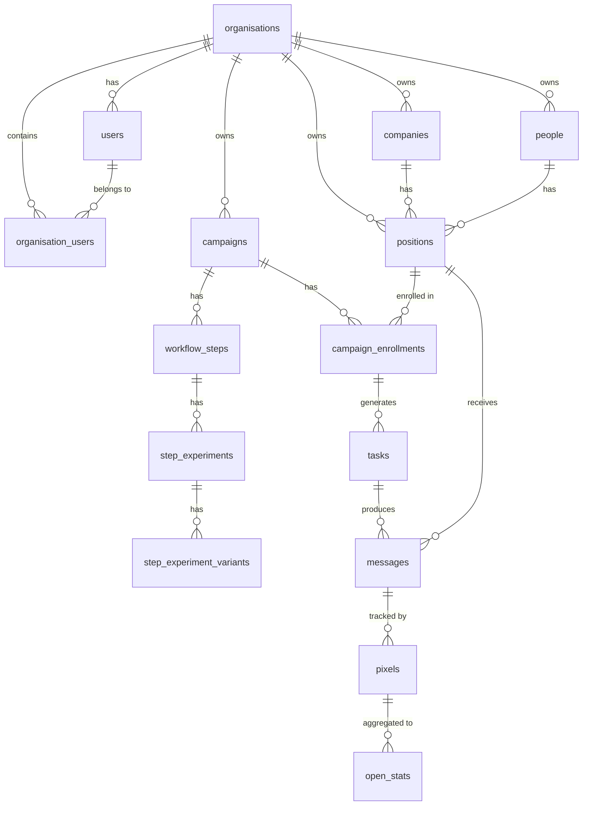
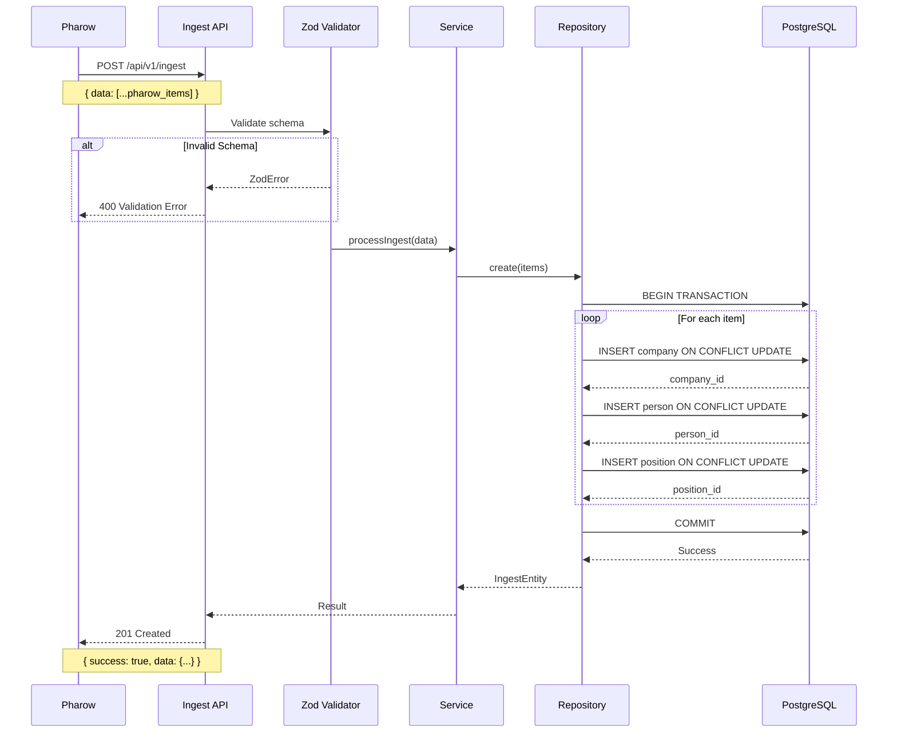
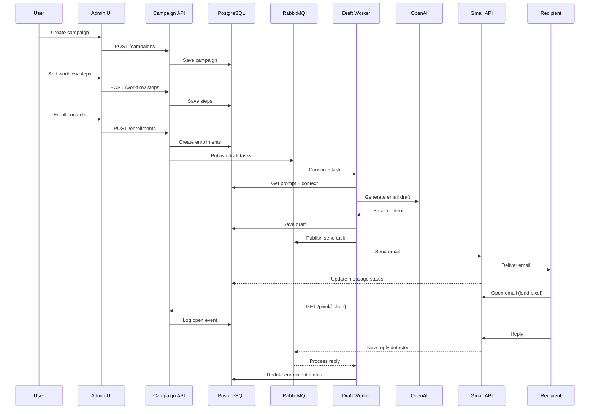
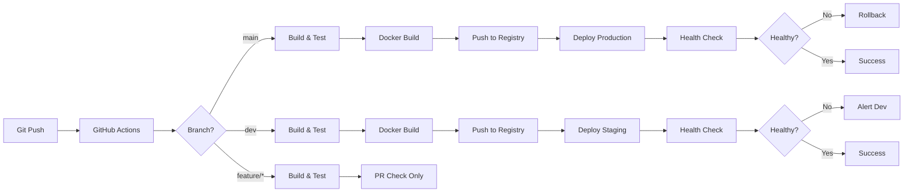

# 🏗️ ProspectFlow - Architecture Documentation

**Version:** 1.0  
**Date:** January 8, 2025  
**Status:** Early Development / Foundation Phase

---

## 📐 System Architecture Overview

### High-Level Architecture (Current State)

```
                                    ┌─────────────────────┐
                                    │   External Data     │
                                    │     (Pharrow)       │
                                    └──────────┬──────────┘
                                               │
                                               │ HTTPS/JSON
                                               ↓
┌───────────────────────────────────────────────────────────────────┐
│                         API LAYER (Active)                        │
│  ┌─────────────────────────────────────────────────────────────┐ │
│  │                     Ingest API (Express.js)                  │ │
│  │                                                               │ │
│  │  ┌──────────┐  ┌──────────┐  ┌──────────┐  ┌──────────┐   │ │
│  │  │  Logging │  │   Auth   │  │   Rate   │  │  Error   │   │ │
│  │  │          │  │(Planned) │  │  Limit   │  │ Handler  │   │ │
│  │  └──────────┘  └──────────┘  └──────────┘  └──────────┘   │ │
│  │                                                               │ │
│  │  ┌──────────────────────────────────────────────────────┐  │ │
│  │  │            Controller Layer (Zod Validation)          │  │ │
│  │  └────────────────────┬─────────────────────────────────┘  │ │
│  │                       ↓                                      │ │
│  │  ┌──────────────────────────────────────────────────────┐  │ │
│  │  │            Service Layer (Business Logic)             │  │ │
│  │  └────────────────────┬─────────────────────────────────┘  │ │
│  │                       ↓                                      │ │
│  │  ┌──────────────────────────────────────────────────────┐  │ │
│  │  │       Repository Layer (Database Operations)          │  │ │
│  │  └────────────────────┬─────────────────────────────────┘  │ │
│  └───────────────────────┼─────────────────────────────────────┘ │
└────────────────────────────┼─────────────────────────────────────┘
                             │
                             ↓
┌───────────────────────────────────────────────────────────────────┐
│                          DATA LAYER                               │
│                                                                   │
│  ┌──────────────────────────────────────────────────────────┐   │
│  │              PostgreSQL 18 (Multi-tenant)                 │   │
│  │                                                            │   │
│  │  ┌─────────────┐  ┌─────────────┐  ┌─────────────┐     │   │
│  │  │ iam schema  │  │ crm schema  │  │  outreach   │     │   │
│  │  │             │  │             │  │   schema    │     │   │
│  │  │ • orgs      │  │ • companies │  │ • campaigns │     │   │
│  │  │ • users     │  │ • people    │  │ • steps     │     │   │
│  │  │ • org_users │  │ • positions │  │ • tasks     │     │   │
│  │  └─────────────┘  └─────────────┘  │ • messages  │     │   │
│  │                                     │ • prompts   │     │   │
│  │                   ┌─────────────┐  └─────────────┘     │   │
│  │                   │  tracking   │                       │   │
│  │                   │   schema    │                       │   │
│  │                   │             │                       │   │
│  │                   │ • pixels    │                       │   │
│  │                   │ • stats     │                       │   │
│  │                   └─────────────┘                       │   │
│  └──────────────────────────────────────────────────────────┘   │
│                                                                   │
│  ┌──────────────┐  ┌──────────────┐  ┌──────────────┐          │
│  │  ClickHouse  │  │    Redis     │  │   RabbitMQ   │          │
│  │  (Analytics) │  │   (Cache)    │  │   (Queue)    │          │
│  │              │  │              │  │              │          │
│  │  Configured  │  │  Configured  │  │  Configured  │          │
│  │  Not Used    │  │  Not Used    │  │  Not Used    │          │
│  └──────────────┘  └──────────────┘  └──────────────┘          │
└───────────────────────────────────────────────────────────────────┘
```

---

## 🎯 Target Architecture (MVP - 3 Months)

```
                    ┌──────────────┐
                    │   Pharrow    │
                    │  (External)  │
                    └──────┬───────┘
                           │
        ┌──────────────────┼──────────────────┐
        │                  │                  │
        ↓                  ↓                  ↓
┌──────────────┐  ┌──────────────┐  ┌──────────────┐
│  Ingest API  │  │ Campaign API │  │  Tracking    │
│              │  │              │  │    API       │
│ • Auth ✓     │  │ • CRUD       │  │ • Pixels     │
│ • Validate   │  │ • Steps      │  │ • Opens      │
│ • Store CRM  │  │ • Enroll     │  │ • Clicks     │
└──────┬───────┘  └──────┬───────┘  └──────┬───────┘
       │                 │                  │
       │    ┌────────────┴────────┐         │
       │    │                     │         │
       ↓    ↓                     ↓         ↓
┌──────────────────────────────────────────────┐
│          Message Queue (RabbitMQ)            │
│                                              │
│  ┌─────────┐  ┌─────────┐  ┌─────────┐     │
│  │ draft   │  │followup │  │ reply   │     │
│  │ queue   │  │ queue   │  │ queue   │     │
│  └─────────┘  └─────────┘  └─────────┘     │
└───┬───────────┬────────────┬────────────────┘
    │           │            │
    ↓           ↓            ↓
┌──────────┐┌──────────┐┌──────────┐
│  Draft   ││ Followup ││  Reply   │
│  Worker  ││  Worker  ││ Detector │
│          ││          ││          │
│ • AI Gen ││ • Sched  ││ • Gmail  │
│ • Prompt ││ • Queue  ││ • Parse  │
│ • Store  ││ • Send   ││ • Update │
└────┬─────┘└────┬─────┘└────┬─────┘
     │           │            │
     └───────────┼────────────┘
                 │
                 ↓
       ┌──────────────────┐
       │   Gmail API      │
       │  (Service Acct)  │
       └──────────────────┘
                 │
                 ↓
       ┌──────────────────┐
       │  Recipient       │
       │  Mailboxes       │
       └──────────────────┘
                 │
                 ↓ (Opens/Clicks)
       ┌──────────────────┐
       │  Tracking API    │
       └─────────┬────────┘
                 │
                 ↓
       ┌──────────────────┐
       │   ClickHouse     │
       │  (Event Stream)  │
       └──────────────────┘
                 │
                 ↓
       ┌──────────────────┐
       │   PostgreSQL     │
       │ (Aggregated)     │
       └──────────────────┘
```

---

## 🗄️ Database Schema Architecture

### Schema Relationships



### Multi-Tenant Isolation Pattern

```
┌───────────────────────────────────────────────────────────┐
│                    All Tables Include                     │
│                   organisation_id (UUID)                  │
└───────────────────────────────────────────────────────────┘
                           │
        ┌──────────────────┼──────────────────┐
        │                  │                  │
        ↓                  ↓                  ↓
┌───────────────┐  ┌───────────────┐  ┌───────────────┐
│  Primary Key  │  │  Foreign Key  │  │    Indexes    │
│               │  │               │  │               │
│  (org_id, id) │  │  (org_id, FK) │  │  org_id first │
│               │  │               │  │               │
│  Ensures UUID │  │  Prevents     │  │  Efficient    │
│  uniqueness   │  │  cross-tenant │  │  filtering    │
│  per tenant   │  │  references   │  │  per tenant   │
└───────────────┘  └───────────────┘  └───────────────┘

Example:
  crm.positions
    ├── id (UUID)
    ├── organisation_id (UUID) ← Partition key
    ├── person_id (UUID)
    ├── company_id (UUID)
    └── email (CITEXT)
    
    UNIQUE (organisation_id, company_id, person_id, email)
    FK (organisation_id, person_id) → people(organisation_id, id)
    FK (organisation_id, company_id) → companies(organisation_id, id)
    
    Result: Impossible to link person from Org A to company in Org B
```

---

## 🔄 Data Flow Diagrams

### Current: Ingest Flow



### Planned: Campaign Execution Flow



---

## 🧩 Component Architecture

### Ingest API - Layered Architecture

```
┌─────────────────────────────────────────────────────────┐
│                    HTTP Layer                           │
│  ┌───────────┐  ┌───────────┐  ┌───────────┐          │
│  │  Express  │  │   CORS    │  │   Body    │          │
│  │  Server   │  │  Config   │  │  Parser   │          │
│  └───────────┘  └───────────┘  └───────────┘          │
└───────────────────────────┬─────────────────────────────┘
                            │
┌───────────────────────────┼─────────────────────────────┐
│                  Middleware Layer                       │
│  ┌───────────┐  ┌───────────┐  ┌───────────┐          │
│  │  Logger   │→ │   Auth    │→ │   Rate    │          │
│  │  (Pino)   │  │  (JWT)    │  │  Limit    │          │
│  └───────────┘  └───────────┘  └───────────┘          │
│                                              ↓          │
│  ┌─────────────────────────────────────────────┐       │
│  │          Error Handler (Global)             │       │
│  └─────────────────────────────────────────────┘       │
└───────────────────────────┬─────────────────────────────┘
                            │
┌───────────────────────────┼─────────────────────────────┐
│                   Route Layer                           │
│  ┌─────────────────────────────────────────────┐       │
│  │  /api/v1/ingest  → IngestController         │       │
│  │  /api/v1/health  → HealthController         │       │
│  │  /metrics        → PrometheusMetrics        │       │
│  └─────────────────────────────────────────────┘       │
└───────────────────────────┬─────────────────────────────┘
                            │
┌───────────────────────────┼─────────────────────────────┐
│                Controller Layer                         │
│  ┌─────────────────────────────────────────────┐       │
│  │  • Parse request                             │       │
│  │  • Validate with Zod schema                  │       │
│  │  • Extract auth context (org_id)             │       │
│  │  • Call service                              │       │
│  │  • Format response                           │       │
│  └─────────────────────────────────────────────┘       │
└───────────────────────────┬─────────────────────────────┘
                            │
┌───────────────────────────┼─────────────────────────────┐
│                  Service Layer                          │
│  ┌─────────────────────────────────────────────┐       │
│  │  • Business logic orchestration              │       │
│  │  • Logging                                   │       │
│  │  • Call repository                           │       │
│  │  • Return domain entities                    │       │
│  └─────────────────────────────────────────────┘       │
└───────────────────────────┬─────────────────────────────┘
                            │
┌───────────────────────────┼─────────────────────────────┐
│                Repository Layer                         │
│  ┌─────────────────────────────────────────────┐       │
│  │  • Database queries (SQL)                    │       │
│  │  • Transaction management                    │       │
│  │  • Connection pooling                        │       │
│  │  • Error handling                            │       │
│  └─────────────────────────────────────────────┘       │
└───────────────────────────┬─────────────────────────────┘
                            │
                            ↓
               ┌─────────────────────┐
               │   PostgreSQL Pool   │
               │   (max 20 conns)    │
               └─────────────────────┘
```

---

## 🔐 Security Architecture

### Authentication Flow (Planned)

```
┌──────────┐                           ┌──────────┐
│  Client  │                           │   Auth   │
│  (UI)    │                           │ Service  │
└────┬─────┘                           └────┬─────┘
     │                                      │
     │ 1. Login (email, password)           │
     │─────────────────────────────────────>│
     │                                      │
     │                         2. Validate  │
     │                         3. Generate  │
     │                            JWT       │
     │                                      │
     │<─────────────────────────────────────│
     │   { token, refresh_token }           │
     │                                      │
┌────┴─────┐                           ┌────┴─────┐
│          │                           │          │
│  Store   │                           │   DB:    │
│  Token   │                           │  users   │
│          │                           │          │
└────┬─────┘                           └──────────┘
     │
     │ 4. API Request
     │    Authorization: Bearer <token>
     │─────────────────────────────────────>
     │                                ┌─────┴──────┐
     │                                │  Ingest    │
     │                                │  API       │
     │                                └─────┬──────┘
     │                                      │
     │                         5. Verify JWT│
     │                         6. Extract   │
     │                            org_id    │
     │                                      │
     │<─────────────────────────────────────│
     │   { data, success: true }            │
     │                                      │
```

### JWT Payload Structure

```json
{
  "sub": "user_id",
  "email": "user@example.com",
  "organisation_id": "org_uuid",
  "role": "admin",
  "iat": 1704672000,
  "exp": 1704758400
}
```

### Request Authorization Matrix

| Endpoint | Method | Auth Required | Tenant Check | Rate Limit |
|----------|--------|---------------|--------------|------------|
| /health | GET | ❌ No | ❌ No | ✅ 100/15min |
| /metrics | GET | ❌ No | ❌ No | ✅ 100/15min |
| /api/v1/ingest | POST | ✅ Yes | ✅ Yes | ✅ 10/min |
| /api/v1/campaigns | GET | ✅ Yes | ✅ Yes | ✅ 100/15min |
| /api/v1/campaigns | POST | ✅ Yes | ✅ Yes | ✅ 20/min |
| /api/v1/campaigns/:id | PUT | ✅ Yes | ✅ Yes + Owner | ✅ 50/min |
| /api/v1/campaigns/:id | DELETE | ✅ Yes | ✅ Yes + Owner | ✅ 10/min |

---

## 📊 Monitoring & Observability Architecture

### Metrics Collection (Planned)

```
┌─────────────────────────────────────────────────────────┐
│                  Application Services                   │
│  ┌──────────┐  ┌──────────┐  ┌──────────┐             │
│  │ Ingest   │  │ Campaign │  │  Draft   │             │
│  │  API     │  │   API    │  │  Worker  │             │
│  └────┬─────┘  └────┬─────┘  └────┬─────┘             │
│       │             │              │                    │
│       │ /metrics    │ /metrics     │ /metrics           │
│       └─────────────┴──────────────┘                    │
└────────────────────────┬────────────────────────────────┘
                         │
                         ↓ (scrape every 15s)
                ┌─────────────────┐
                │   Prometheus    │
                │   (Time-Series  │
                │    Database)    │
                └────────┬────────┘
                         │
                         ↓ (query)
                ┌─────────────────┐
                │    Grafana      │
                │  (Dashboards)   │
                └─────────────────┘
                         │
                         ↓ (alerts)
                ┌─────────────────┐
                │  AlertManager   │
                │   (Notify OPS)  │
                └─────────────────┘
```

### Logging Architecture (Planned)

```
┌─────────────────────────────────────────────────────────┐
│                Application Services                     │
│  ┌──────────┐  ┌──────────┐  ┌──────────┐             │
│  │ Service1 │  │ Service2 │  │ Service3 │             │
│  │  Pino    │  │  Pino    │  │  Pino    │             │
│  └────┬─────┘  └────┬─────┘  └────┬─────┘             │
│       │ stdout      │ stdout      │ stdout             │
└───────┼─────────────┼─────────────┼─────────────────────┘
        │             │             │
        └─────────────┴─────────────┘
                      │
                      ↓ (Docker logs)
               ┌──────────────┐
               │   Fluentd    │
               │ (Log Router) │
               └──────┬───────┘
                      │
        ┌─────────────┼─────────────┐
        │             │             │
        ↓             ↓             ↓
┌──────────────┐ ┌──────────────┐ ┌──────────────┐
│ Elasticsearch│ │  CloudWatch  │ │   Datadog    │
│ (Search)     │ │   (AWS)      │ │ (Monitoring) │
└──────────────┘ └──────────────┘ └──────────────┘
```

---

## 🚀 Deployment Architecture

### Development Environment

```
┌──────────────────────────────────────────────────────────┐
│                  Local Machine (Docker)                  │
│                                                          │
│  ┌────────────────┐  ┌────────────────┐                │
│  │  PostgreSQL    │  │   pgAdmin      │                │
│  │   :5432        │  │   :5050        │                │
│  └────────────────┘  └────────────────┘                │
│                                                          │
│  ┌────────────────┐  ┌────────────────┐                │
│  │   ClickHouse   │  │    Tabix       │                │
│  │   :8123/:9000  │  │   :8080        │                │
│  └────────────────┘  └────────────────┘                │
│                                                          │
│  ┌────────────────┐  ┌────────────────┐                │
│  │     Redis      │  │   RabbitMQ     │                │
│  │    :6379       │  │ :5672/:15672   │                │
│  └────────────────┘  └────────────────┘                │
│                                                          │
│  ┌──────────────────────────────────────────────────┐  │
│  │           Ingest API (Hot Reload)                │  │
│  │               pnpm dev                           │  │
│  │               :3000                              │  │
│  └──────────────────────────────────────────────────┘  │
│                                                          │
│              Network: prospectflow-network               │
└──────────────────────────────────────────────────────────┘
```

### Production Architecture (Target)

```
                    ┌─────────────────┐
                    │   CloudFlare    │
                    │   (CDN + DDoS)  │
                    └────────┬────────┘
                             │ HTTPS
                             ↓
                    ┌─────────────────┐
                    │      NGINX      │
                    │  (Load Balance) │
                    └────────┬────────┘
                             │
              ┌──────────────┼──────────────┐
              │              │              │
              ↓              ↓              ↓
     ┌────────────┐  ┌────────────┐  ┌────────────┐
     │  Ingest    │  │  Campaign  │  │  Tracking  │
     │  API Pod   │  │  API Pod   │  │  API Pod   │
     │  (x3)      │  │  (x2)      │  │  (x2)      │
     └─────┬──────┘  └─────┬──────┘  └─────┬──────┘
           │               │               │
           └───────────────┼───────────────┘
                           │
                ┌──────────┼──────────┐
                │          │          │
                ↓          ↓          ↓
       ┌────────────┐ ┌────────────┐ ┌────────────┐
       │ PostgreSQL │ │ ClickHouse │ │  RabbitMQ  │
       │  Primary   │ │  Cluster   │ │  Cluster   │
       │            │ │            │ │            │
       │  Replica1  │ │  (Sharded) │ │ (HA Mode)  │
       │  Replica2  │ │            │ │            │
       └────────────┘ └────────────┘ └────────────┘
                │
                ↓
       ┌────────────────┐
       │   S3 Backups   │
       │  (Daily + WAL) │
       └────────────────┘
```

---

## 📦 Docker Network Topology

### Current Network Configuration

```
prospectflow-network (bridge)
├── postgres (prospectflow-postgres)
│   └── Ports: 5432
├── pgadmin (prospectflow-pgadmin)
│   └── Ports: 5050:80
├── flyway (prospectflow-flyway)
│   └── Runs migrations, exits
└── ingest-api (prospectflow-ingest-api)
    └── Ports: 3000:3000

clickhouse-network (bridge)
├── clickhouse (clickhouse-server)
│   └── Ports: 8123:8123, 9000:9000
└── tabix (clickhouse-tabix)
    └── Ports: [TABIX_PORT]:80
```

### Service Discovery

All services on `prospectflow-network` can communicate using service names:

```typescript
// From ingest-api, connect to postgres:
const pool = new Pool({
  host: 'postgres',  // ← Service name resolves via Docker DNS
  port: 5432,
  // ...
});

// Connect to Redis (when added):
const redis = new Redis({
  host: 'redis',
  port: 6379,
});

// Connect to RabbitMQ:
const connection = await amqp.connect('amqp://rabbitmq:5672');
```

---

## 🔄 CI/CD Pipeline (Planned)



---

## 📚 Technology Stack Summary

| Layer | Technology | Version | Status |
|-------|-----------|---------|--------|
| **Runtime** | Node.js | 20.x | ✅ Active |
| **Language** | TypeScript | 5.8.2 | ✅ Active |
| **Framework** | Express.js | 4.21.2 | ✅ Active |
| **Validation** | Zod | 3.24.3 | ✅ Active |
| **Database** | PostgreSQL | 18 | ✅ Active |
| **Analytics** | ClickHouse | Latest | ⚙️ Configured |
| **Cache** | Redis | 7 | ⚙️ Configured |
| **Queue** | RabbitMQ | Latest | ⚙️ Configured |
| **Migration** | Flyway | 11 | ✅ Active |
| **Logging** | Pino | 9.6.0 | ✅ Active |
| **Testing** | Vitest | 3.0.5 | ✅ Active |
| **Container** | Docker | Latest | ✅ Active |
| **Orchestration** | Docker Compose | v2 | ✅ Active |
| **Package Manager** | pnpm | 10.9.0 | ✅ Active |

---

## 🎯 Scalability Considerations

### Horizontal Scaling Strategy

**Stateless Services (Easy to Scale):**
- Ingest API → Can run multiple instances behind load balancer
- Campaign API → Stateless, cache in Redis
- Worker services → Multiple consumers on same queue

**Stateful Services (Require Clustering):**
- PostgreSQL → Primary + Read Replicas
- RabbitMQ → Cluster mode (3+ nodes)
- ClickHouse → Distributed tables across shards
- Redis → Sentinel or Cluster mode

### Performance Targets

| Metric | Current | Target (MVP) | Target (1 Year) |
|--------|---------|--------------|-----------------|
| **API Latency (p95)** | ~100ms | < 200ms | < 100ms |
| **Throughput** | ~10 req/s | 100 req/s | 1000 req/s |
| **Database Queries** | ~50ms | < 100ms | < 50ms |
| **Concurrent Users** | 1 | 100 | 10,000 |
| **Emails/Hour** | 0 | 1,000 | 100,000 |

---

*Architecture documentation by BMAD Analyst Agent - January 8, 2025*
