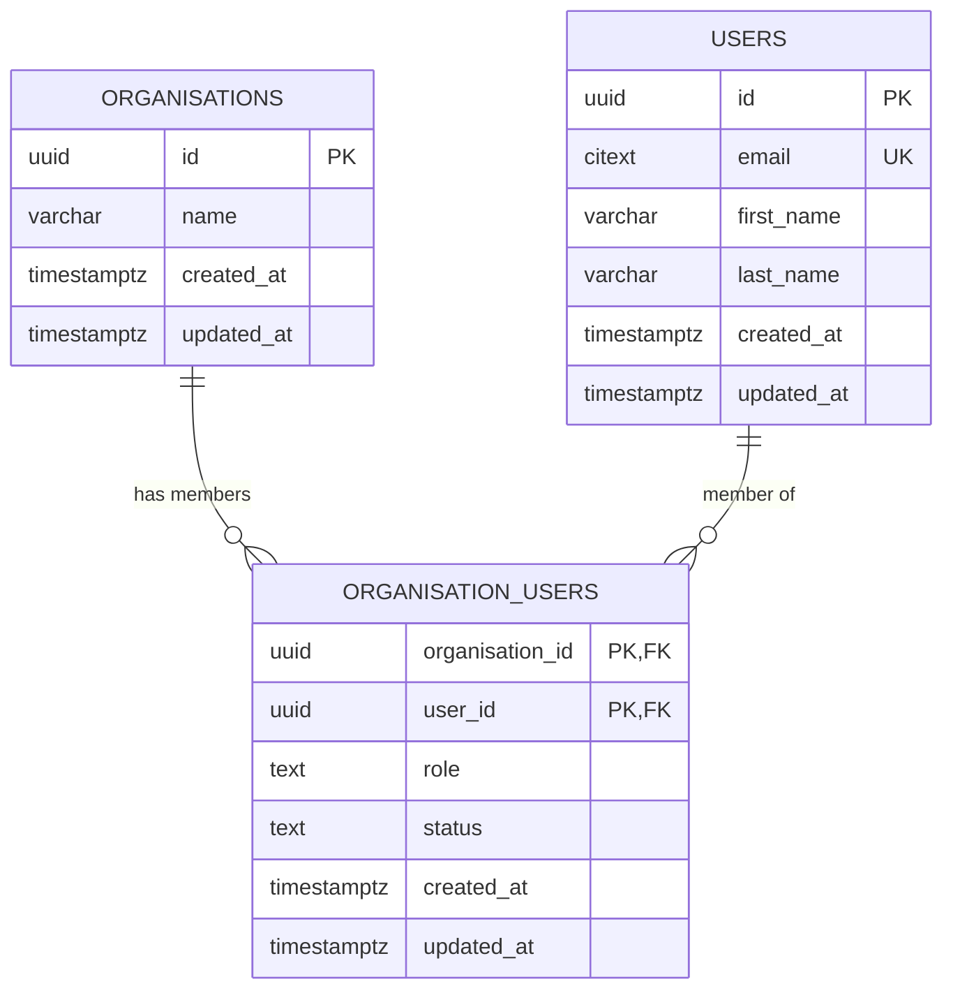
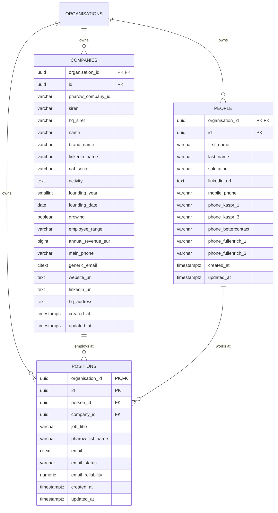
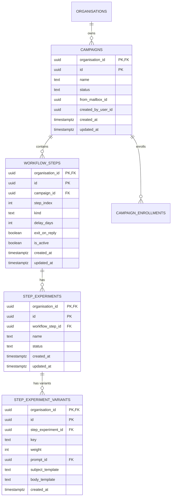
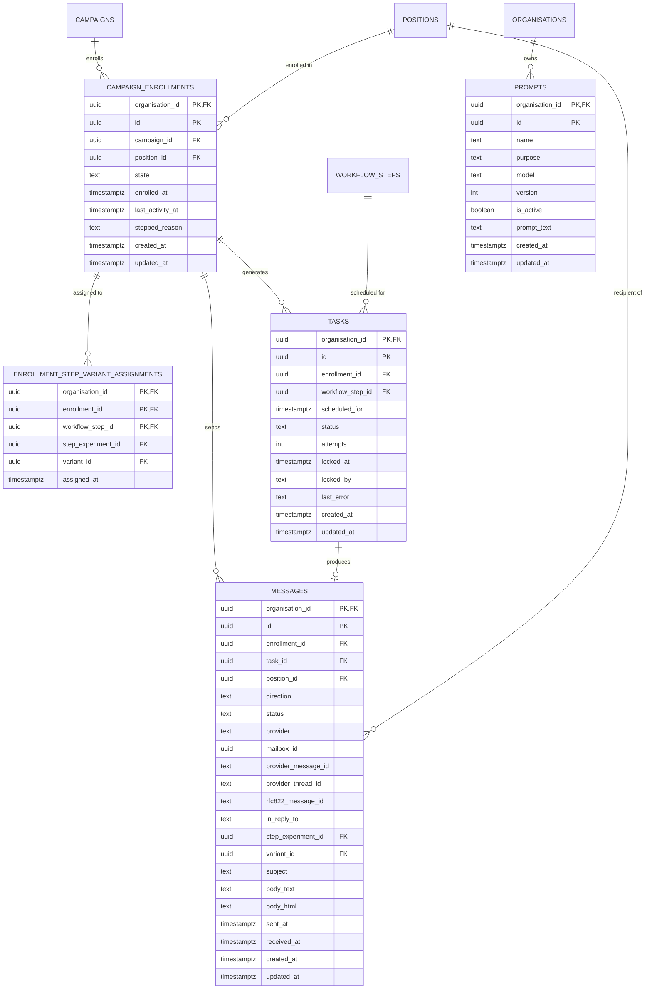
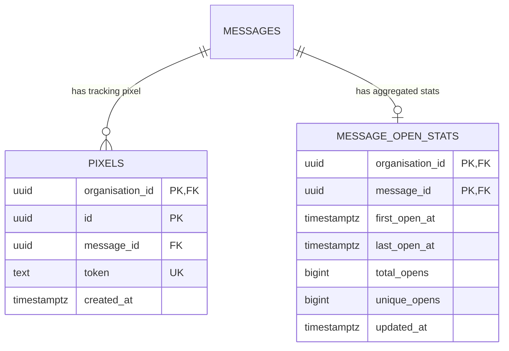

# ProspectFlow Database - Entity Relationship Diagram

## Overview

This document provides visual representations of the ProspectFlow database schema, organized by domain.

## Multi-Tenant Architecture

All tables (except `iam.organisations` and `iam.users`) include `organisation_id` as part of their composite primary key to ensure data isolation between tenants.

**Pattern:**

```
PRIMARY KEY (organisation_id, id)
```

**Foreign Keys:**

```
FOREIGN KEY (organisation_id, referenced_id)
REFERENCES schema.table(organisation_id, id)
```

---

## IAM Schema (Identity & Access Management)



**Notes:**

- `ORGANISATIONS`: Central tenant/organization entity
- `USERS`: User accounts (can belong to multiple organizations)
- `ORGANISATION_USERS`: Many-to-many junction with role-based access (owner, admin, member, viewer)
- Unique constraint ensures exactly 1 owner per organization

---

## CRM Schema (Contact Relationship Management)



**Notes:**

- `COMPANIES`: Business entities with French market integration (SIREN, NAF, Pharow)
- `PEOPLE`: Individual contacts (phone numbers from multiple enrichment providers)
- `POSITIONS`: Junction table linking people to companies with email addresses
- Email normalization: Email stored at position level (one person can have multiple emails across positions)

---

## Outreach Schema (Campaign Management)

### Core Campaign Structure



### Campaign Execution & Messaging



**Notes:**

- `CAMPAIGNS`: Email campaign definitions with status tracking
- `WORKFLOW_STEPS`: Multi-step sequences with delays and exit conditions
- `CAMPAIGN_ENROLLMENTS`: Tracks prospect enrollment in campaigns with state management
- `TASKS`: Scheduled actions (intention to send) with retry logic
- `MESSAGES`: Actual sent/received emails (events) with Gmail integration
- `PROMPTS`: Versioned AI prompt templates for email generation
- `STEP_EXPERIMENTS` + `STEP_EXPERIMENT_VARIANTS`: A/B testing framework per step
- `ENROLLMENT_STEP_VARIANT_ASSIGNMENTS`: Stable A/B variant assignment (no variant switching mid-campaign)

**Key Design Patterns:**

- **Tasks vs Messages**: Tasks represent intention, Messages represent events
- **Enrollment Model**: Better state tracking than simple prospect-campaign linking
- **A/B Testing**: Built-in at step level with stable assignments
- **Multi-directional**: Messages can be outbound (sent) or inbound (received)

---

## Tracking Schema (Analytics & Monitoring)



**Notes:**

- `PIXELS`: Email open tracking via unique tokens (1-pixel image)
- `MESSAGE_OPEN_STATS`: Aggregated open metrics per message
- Individual open events stored in ClickHouse for detailed analytics
- PostgreSQL stores aggregated data for fast queries

---

## Cross-Schema Relationships

### IAM → CRM

```
iam.organisations → crm.companies
iam.organisations → crm.people
iam.organisations → crm.positions
```

### CRM → Outreach

```
crm.positions → outreach.campaign_enrollments
crm.positions → outreach.messages
```

### Outreach → Tracking

```
outreach.messages → tracking.pixels
outreach.messages → tracking.message_open_stats
```

---

## Indexes Summary

### Performance-Critical Indexes

**IAM:**

- `idx_org_users_user_id` - User lookup in organizations
- `idx_users_email` - Email-based authentication

**CRM:**

- `idx_people_org_email` - Email lookup within tenant
- `idx_people_status` - Status filtering
- `idx_companies_org` - Company listings
- `idx_positions_org_email` - Email-based prospect lookup

**Outreach:**

- `idx_campaigns_org_status` - Active campaign queries
- `idx_messages_org_campaign` - Campaign message history
- `idx_messages_status` - Status-based filtering
- `idx_tasks_org_status` - Task queue processing
- `idx_messages_org_thread` - Thread-based conversation tracking

**Tracking:**

- `idx_pixels_message` - Pixel-to-message lookup
- `idx_stats_campaign_date` - Time-series analytics

**Multi-Tenant Pattern:**
All indexes include `organisation_id` as the first column for partition pruning and query performance.

---

## Data Flow

### Prospect Onboarding Flow

```
1. CSV Upload
   ↓
2. Parse → crm.companies + crm.people + crm.positions
   ↓
3. Enrich → Update positions with enriched emails
   ↓
4. Campaign Assignment → outreach.campaign_enrollments
```

### Email Sending Flow

```
1. Campaign Created → outreach.campaigns
   ↓
2. Workflow Defined → outreach.workflow_steps
   ↓
3. Prospects Enrolled → outreach.campaign_enrollments
   ↓
4. Tasks Scheduled → outreach.tasks (with delays)
   ↓
5. Draft Generated → AI uses prompts + prospect data
   ↓
6. Message Sent → outreach.messages (status: sent)
   ↓
7. Pixel Created → tracking.pixels (for open tracking)
```

### Response Handling Flow

```
1. Gmail Webhook → Inbound email detected
   ↓
2. Message Created → outreach.messages (direction: inbound)
   ↓
3. Thread Matched → provider_thread_id linking
   ↓
4. Enrollment Updated → campaign_enrollments.state = 'replied'
   ↓
5. Future Tasks Cancelled → tasks.status = 'cancelled'
```

---

## Query Patterns

### Multi-Tenant Query (Required Pattern)

```sql
-- ❌ WRONG - No tenant isolation
SELECT * FROM crm.people WHERE email = 'test@example.com';

-- ✅ CORRECT - Always include organisation_id
SELECT * FROM crm.people
WHERE organisation_id = ? AND email = 'test@example.com';
```

### Composite Foreign Key Query

```sql
-- ✅ Join using both organisation_id and id
SELECT p.first_name, p.last_name, c.name as company_name
FROM crm.positions pos
JOIN crm.people p ON pos.organisation_id = p.organisation_id AND pos.person_id = p.id
JOIN crm.companies c ON pos.organisation_id = c.organisation_id AND pos.company_id = c.id
WHERE pos.organisation_id = ?;
```

### Campaign Enrollment with A/B Variant

```sql
-- Get enrolled prospects with their assigned A/B variants
SELECT
  e.id,
  p.first_name,
  p.last_name,
  pos.email,
  ws.step_index,
  v.key as variant_key
FROM outreach.campaign_enrollments e
JOIN crm.positions pos ON e.organisation_id = pos.organisation_id AND e.position_id = pos.id
JOIN crm.people p ON pos.organisation_id = p.organisation_id AND pos.person_id = p.id
JOIN outreach.enrollment_step_variant_assignments a ON e.organisation_id = a.organisation_id AND e.id = a.enrollment_id
JOIN outreach.workflow_steps ws ON a.organisation_id = ws.organisation_id AND a.workflow_step_id = ws.id
JOIN outreach.step_experiment_variants v ON a.organisation_id = v.organisation_id AND a.variant_id = v.id
WHERE e.organisation_id = ?
  AND e.campaign_id = ?;
```

---

## Schema Version History

| Version | Date       | Description                                      | Migration        |
| ------- | ---------- | ------------------------------------------------ | ---------------- |
| 1.0     | 2025-12-23 | Base init - Extensions, schemas, triggers        | V20251223_112356 |
| 1.1     | 2025-12-23 | IAM schema - Organizations, users, roles         | V20251223_112456 |
| 1.2     | 2025-12-23 | CRM schema - Companies, people, positions        | V20251223_112543 |
| 1.3     | 2025-12-23 | Outreach/Tracking schemas                        | V20251223_125520 |
| 1.4     | 2025-12-23 | Outreach tables - Campaigns, workflows, messages | V20251223_125614 |
| 1.5     | 2025-12-23 | Tracking tables - Pixels, open stats             | V20251223_125657 |

---

## Additional Resources

- [Database Setup Guide](README.md)
- [Validation Documentation](db/VALIDATION.md)
- [Validation Test Suite](db/validation-tests.sql)
- [Backup Scripts](scripts/backup.sh)
- [Restore Scripts](scripts/restore.sh)
- [Architecture Documentation](../../doc/ARCHITECTURE.md)
